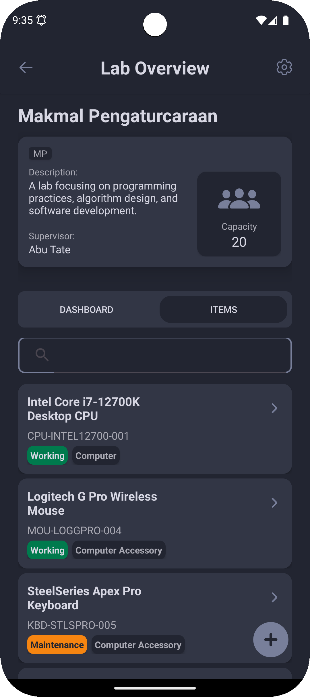

# Lab Inventory System

This is a mobile application designed to streamline the management and monitoring of laboratories within the Faculty of Internet Technology and Communications (FICT) at Universiti Teknikal Malaysia Melaka (UTeM).

## Overview

The Lab Inventory System replaces traditional paper-based methods for recording lab information with a digital solution. It ensures that key data about each lab, including its name, supervisor, and inventory, is systematically stored and managed.  The application also allows administrators to monitor the condition of lab equipment, making it easier to identify facilities that need maintenance.

## Key Features

*   **Lab Management:**
    *   Create new labs with detailed information (name, code, supervisor, capacity, description)
    *   View, search, and edit existing labs
    *   Delete labs when necessary
    *   View an overview dashboard summarizing total labs, total items, and item condition analysis.
*   **Item Management:**
    *   Add new items with name, serial number, type, and condition
    *   View, edit and delete existing items
    *   View items that required maintenance
*   **Automated Item Condition Tracking:**
    *   Background tasks that check the item condition and trigger notifications for items that needs maintenance
    *   Notification settings
*   **Data Storage:** Utilizes SQLite database for storing lab and item data through the Room Library.
*   **User Interface:** Provides an efficient and user-friendly interface for all functionalities using Model-View-ViewModel (MVVM) architecture.
*   **Draft Saving:** Save draft of lab or item forms using Shared Preference functionalities.

## Problem Solved

This application addresses the following challenges faced in traditional lab management:

1.  **Inefficiency of Paper-Based Systems:** Eliminates the tedious and error-prone process of recording lab details on paper.
2.  **Difficulty in Monitoring Facilities:** Provides a digital system to track item conditions and identify items needing maintenance, reducing delays and oversight.
3.  **Lack of Real-Time Access:** Allows administrators to quickly access specific lab information, eliminating the need for manual document searches.

## Architecture

The application utilizes the Model-View-ViewModel (MVVM) architectural pattern to ensure scalability, maintainability, and separation of concerns.

* **Data Storage:** SQLite with Room library.
* **Shared Preferences:** For saving drafts of form.
* **Background Tasks:** For sending notifications.

## Team Members

The development of this project was a collaborative effort, with the following module distributions:

*   **Aiman Afiq Bin Suradi:**
    *   App Database
    *   Lab Model
    *   Item Model
    *   Lab DAO
    *   Item DAO
    *   View Lab Dashboard
    *   View Item Dashboard
*   **Muhamad Fikrizulhaq Bin Mohd Tamin:**
    *   Handle Notification Permission
    *   Item Condition Worker
    *   Search Lab
    *   Search Item
*   **Nizkia Silalahi Binti Musawir:**
    *   Create Lab
    *   Update Lab
    *   Delete Lab
    *   View Lab Details
    *   View Lab Lists
*   **Nurul Dayana Binti Mohd Khairy:**
    *   Create Item
    *   Update Item
    *   View Item List
    *   View Item Details

## Program Sample Run
### Lab Overview

### Create Lab

### Lab Details

### Lab Settings

### Items List

### Notification

## YouTube Presentation

## Getting Started

**To run this application:**
1.  Clone this repository.
2.  Import into Android Studio.
3.  Build and deploy to an Android device or emulator.